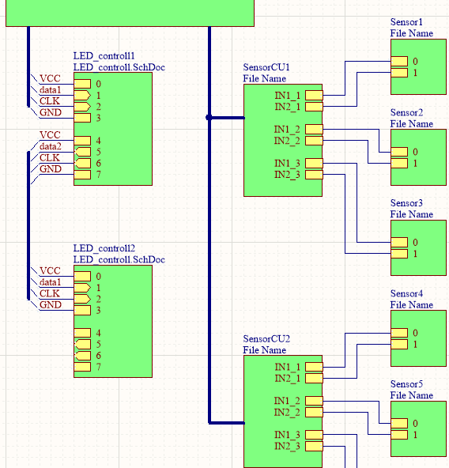
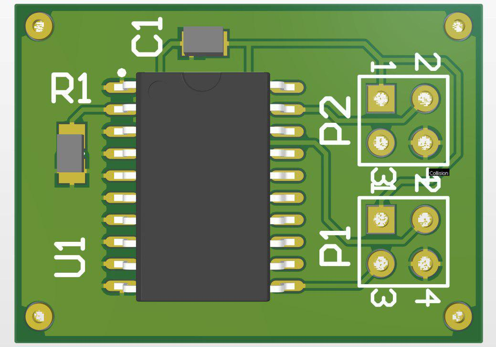

# skinn electronic 
## basic concept
The task to controll/measure the leds and sensors of the skin, has been splited into two subtasks. 
The LED controller, which are connected via daisy chain and the the Sensor controll unit. 

  
   
  Overview

### LED controller 
The LED controller will cycle through every member of the daisy chain. To initialize this process there has to be a high impulse one the first data1 connection which will lead to high output on the data2 line (synced with rising edge of the clk). 

init MCU (main controll unit):
- Low on the first data line 
- run a clk signal as many times as there are daisy chain members (to ensure no LED is turned on)

start conversation:
- high on the first data line 
- low to high on clk. 

cycle through every led
- low on the first data line
- low to high impulse on clk when the next led should light up

  
   LED Controller 3D

### Sensor CU
The SensorCU's are connected via a bus and continiously geather analog data from the sensors. This data is then convert into a digital format and saved till the main controll unit request the data. 

To do so a DSP is used, due to the fact that dsp's are optimized for many adc-converstaions 

### kicad data
To convert the Altium files to KiCad files the projekt ["altium2kicad"](https://github.com/thesourcerer8/altium2kicad) was used. 
