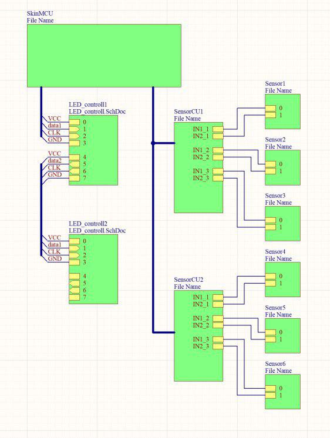

# skinn electronic 
## basic concept
The task to controll/measure the leds and sensors of the skin, has been splited into two subtasks. 
The LED controller, which are connected via daisy chain and the the Sensor controll unit. 

  
   
  Overview

### LED controller 
The LED controller will cycle through every member of the daisy chain. To initialize this process there has to be high impulse one the first data1 connection which will lead to high output on the data2 line (synced with rising edge of the clk). 

  
   LED Controller 3D

### Sensor CU 
The SensorCU's are connected via a bus and continiously geather AC-data, convert it to digital data and add a timestamp. 

### kicad data 
To convert the Altium files to KiCad files the projekt ["altium2kicad"](https://github.com/thesourcerer8/altium2kicad) was used. 
